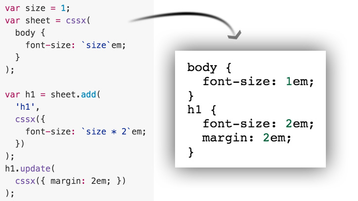

# CSSX - CSS in JavaScript

> Generate and/or apply CSS with JavaScript. Try it out [here](http://krasimir.github.io/cssx/playground/try-it-out/).

---

Language:

* [CSSX language](./docs/cssx-lang.md)

Packages:

* [cssx client-side library](./packages/cssx) ([download](./packages/cssx/lib))
* [cssx-transpiler](./packages/cssx-transpiler) ([download](./packages/cssx-transpiler/lib) or `npm i cssx-transpiler`)
* [gulp plugin](./packages/gulp-cssx) (`npm i gulp-cssx -D`)
* [webpack loader](./packages/cssx-loader) (`npm i cssx-loader -D`)

Examples:

* [Try it out](./playground/try-it-out)
* [Basic](./playground/basic)
* [Transpiling](./playground/transpiler)
* [Transpiling with gulp](./playground/transpiler-gulp)
* [Transpiling with webpack](./playground/transpiler-webpack)

---



## Testing

```
npm test
```

or if you want to run the tests continuously

```
npm run test-watch
```

or if you want to run the tests in a debug mode

```
npm run test-debug
```

---

## Building

```
npm i
npm run make
```

---

## Developing

```
npm i
npm run dev
```
