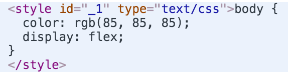

# CSSX plugins

[CSSX client-side library](https://github.com/krasimir/cssx/tree/master/packages/cssx) accepts plugins in the form of JavaScript functions. Every function accepts a raw JavaScript literal and should return such one. For example:

```js
// defining the plugin
var plugin = function (styles) {
  if (styles.margin) {
    styles.margin = '22px';
    styles.padding = '6px';
  }
  return styles;
}

// registering the plugin in CSSX library
cssx.plugins([plugin]);

// creating a new stylesheet
var sheet = <style></style>;

// adding a rule
sheet.add(<style>
  body {
    margin: 10px;
  }
</style>);
```

Our `plugin` function above is called against every CSS rule in our stylesheet. In this particular example it's fired only once with `{ margin: '10px' }`. The result of this snippet is:

```css
body {
  margin: 22px;
  padding: 6px;
}
```

*If you want to try it go to the [CSSX repl](http://krasimir.github.io/cssx/playground/try-it-out/) and paste the example code in the right side of the screen.*

## Available plugins

We may use the enormous [PostCSS plugins collection](https://github.com/postcss/postcss/blob/master/docs/plugins.md). There are tons of really cool plugins and we could mix them together with CSSX. 

```js
// cssx client-side library
var cssx = require('cssx');

// postcss for the browser
var postcssJs = require('postcss-js');

// postcss plugin
var colorGrey = require('postcss-color-gray');

// registering postcss plugin
var postcssPlugins = postcssJs.sync([ colorGrey ]);

// creating a CSSX plugin function
var plugin = function (styles) {
  return postcssPlugins(styles);
};

// registering the CSSX plugin
cssx.plugins([ plugin ]);

// creating a simple stylesheet
var sheet = <style>
  body {
    color: gray(85);
    display: flex;
  }
</style>;
```

The result is a `<style>` tag injected into the page:



*Check out the full working example [here](https://github.com/krasimir/cssx/tree/master/playground/postcss-in-browser)*

